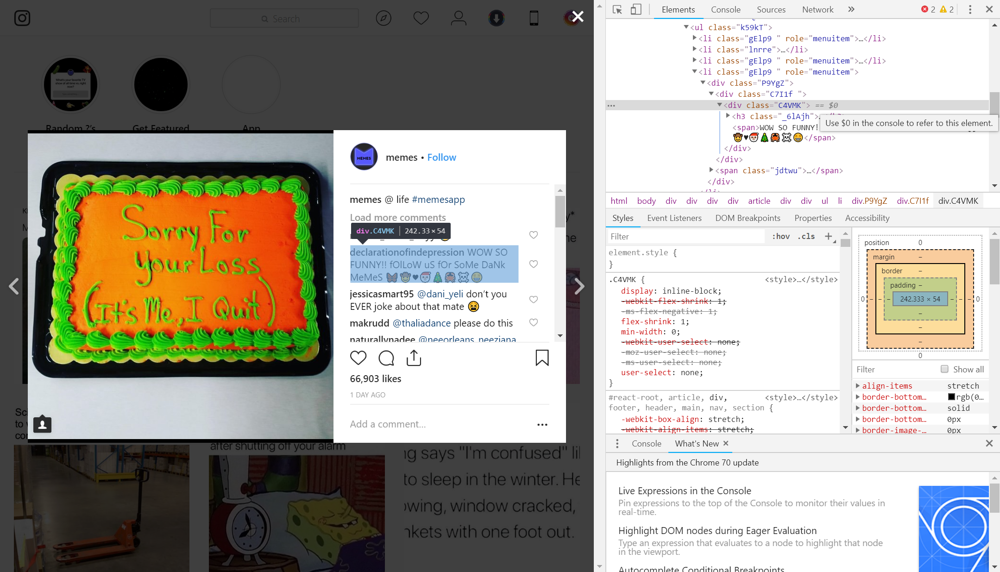

# Instagram-Bot-Selenium

This is a bot created for Instagram with the purpose of following users and liking photos.

I originally wanted to create this bot as a means to gain followers, and since the creation of the bot, I've been able to gain a significant amount of followers on my account. The niche that my instagram account was in is the "meme" posting niche, where I would repost funny and relatable content for users of instagram to consume. 

I was able to create this bot using Selenium and using the *inspect* button on Google Chrome

The strategy that I deploy here is unique from most bots that I've seen around the internet, and I'll go more in depth about that later down in this description.

I primarily wanted to start very low level with my development of this software. In particular, I got the functionality of following and liking photos down first. After this, I created the functionality of following users who comment on a particular post. Then I created the function of following users who comment on a particular *set* of posts that a popular account has in their most recent feed. 

The particular strategy I was aiming for was in order to get the maximum amount of followers from using this bot was:
1. Compile a list of popular meme accounts and funny accounts, and cycle through them
2. Compile a list of the most recent posts a popular meme account has posted on their account
3. Compile a list of the users who have commented on these posts who **tag their friends**
4. Go to the users profile who tagged their friend, and if their account is:
    1. Private: Request to follow them, and move on.
    2. Public: Follow the user, and then like their most recent photo.
    
From this strategy we should be able follow quite a bit of people. 

The reason why I think this strategy works so well is because I am targeting the audience that…
1. Likes memes
2. Already follows meme accounts
3. Tags their friends in memes

This is so important is because if these users follow me back, they are the kind of audience that will most likely interact with my memes by liking the photos and commenting on them. Furthermore, the fact that the target audience likes to tag their friends also means that they are likely to tag their friends in my posts as well, thus driving even more traffic to my page. 

**Concerining the limits Instagram puts on users:** Instagram purposely sets a lot of invisible limits against the user which prevent mass following and botting. Here are some ways that my program gets around that. 
* For every person the bot follows or request to follow, it can set a wait time in between.
    * This helps create a kind of cooldown.
* For every *n* (burst_follows) people the bot follows in one "burst", it will wait for *t* time (time_burst_interval)
    * This time is supposed to be longer than the normal cooldown time, as a kind of a longer cooldown time.
    * The suggested times the bot uses are 35 burst follows, and 700 seconds for the interval until the next 35 follows.
* For every 399 people that the bot follows in one "session", it will wait for a random time which is 43200 seconds plus some random amount of time.
* For every time the bot detects that Instagram is preventing the bot from following people, it waits for a random time which is 43200 seconds plus some random amount of time.

I also included a lot of other ways to interact with Instagram and Instagram audiences, but this really seemed like the most effective way to gain followers. 

## Notes

The project was compiled in python 3.7

This is currently unfinished, but I intend on working on it some more later. 

## Functionality I Want to Add

I'd also like to get this project working with SQL, and compile a list of users who currently follow me, and a list of users who I've followed in the past. If I do this, I can prevent accidentally following people who I do not need to target. 

There is another limit Instagram has which is that it will prevent your account from following anyone if you are already following more than 7500 pages. I need to create a function to check my amount of followers, and unfollow those users who don't follow me currently

